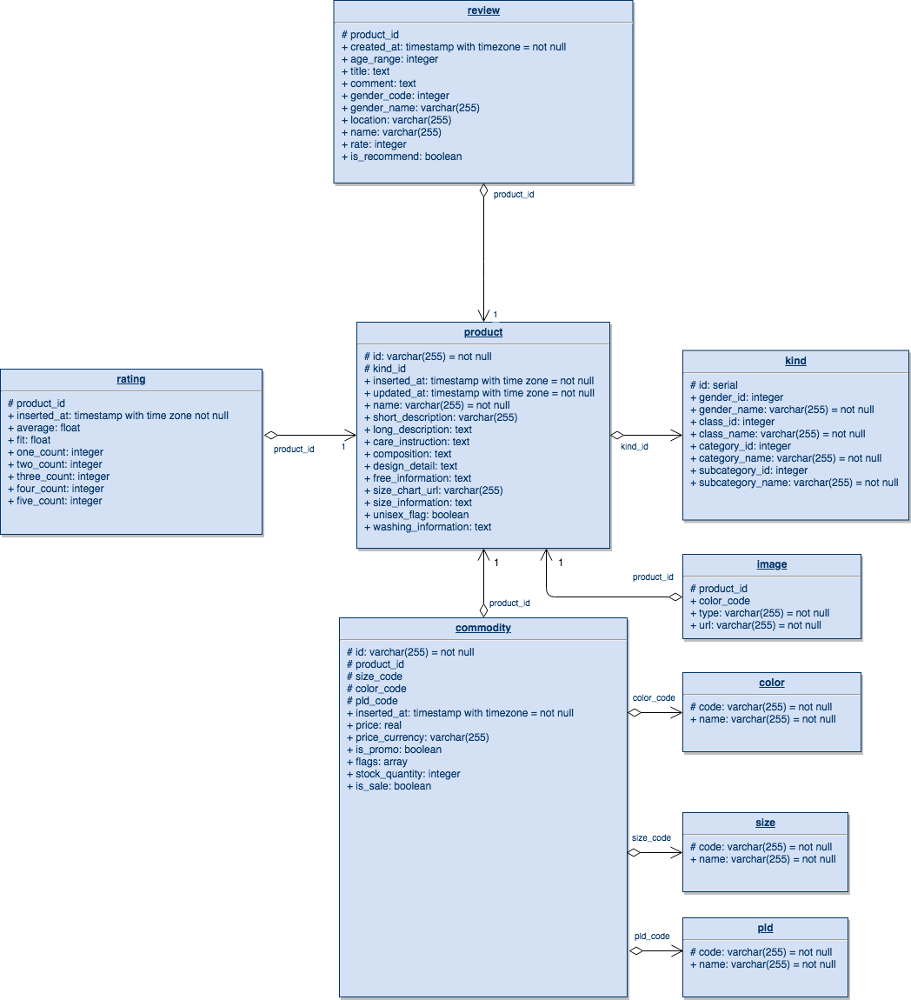

# Uniqlo

Crawl Uniqlo online store, provide api for further analysis.

## Installation
### spider
Use Scrapy to crawl data.

1. Go to `uniqlo/spider` folder, install dependencies.

```bash
pipenv install
```

2. Set up Postgres, create database.

```bash
psql
\i spider/spider/db/init_db.sql
```

3. Copy `uniqlo/spider/config-template.py` to `uniqlo/spider/config.py`, modify the databse related information (e.g., `DB_HOST`, `DB_PORT`, etc).

4. Run scrapy. Go to `uniqlo/spider/spider` folder, run the following command:

```bash
scrapy crawl uniqlo_ca
```


## backend

- Use Spring Boot to provide database access and REST api support.
- Use Shiro for authentication and authorization support.

Go to `uniqlo/backend` folder, run the application with following command:

```bash
./mvnw spring-boot:run
```


## Database Design

